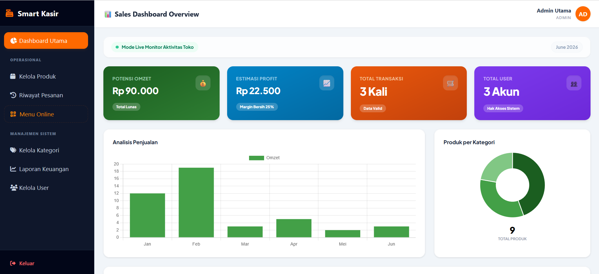

# 📸 Preview Aplikasi

## 📊 Dashboard

Dashboard merupakan halaman utama yang ditampilkan setelah pengguna berhasil masuk ke dalam sistem. Halaman ini menyajikan ringkasan informasi penting seperti jumlah menu, total transaksi, pendapatan, serta statistik penjualan sehingga pengguna dapat memantau kondisi bisnis secara cepat dan efisien.

  

---

## 📦 Kelola Menu

Halaman **Kelola Menu** digunakan untuk mengelola seluruh data menu yang tersedia pada aplikasi kasir. Administrator dapat menambahkan menu baru, mengubah informasi menu, memperbarui harga dan stok, serta menghapus menu yang sudah tidak digunakan.

  

---

## 🏷️ Kelola Kategori

Fitur **Kelola Kategori** memudahkan administrator dalam mengelompokkan menu berdasarkan kategori tertentu, seperti makanan, minuman, atau camilan. Pengelompokan ini membuat proses pencarian dan pengelolaan menu menjadi lebih terstruktur.

  

---

## 🧾 Riwayat Pesanan

Menu **Riwayat Pesanan** menampilkan seluruh transaksi yang telah dilakukan. Pengguna dapat melihat detail pesanan, status pembayaran, total transaksi, serta riwayat aktivitas penjualan sebagai bahan evaluasi maupun audit.

  

---

## 🌐 Katalog Menu Online

Katalog Menu Online memungkinkan pelanggan melihat daftar menu secara digital melalui browser atau QR Code. Informasi yang ditampilkan meliputi nama menu, harga, gambar, dan deskripsi produk sehingga pelanggan dapat melakukan pemesanan dengan lebih mudah.

  

---

## 💳 Pembayaran Berhasil

Halaman **Pembayaran Berhasil** ditampilkan setelah proses transaksi selesai diproses. Sistem akan memberikan konfirmasi bahwa pembayaran telah berhasil dilakukan dan transaksi telah tersimpan ke dalam database.

  

---

## 🧾 Cetak Struk

Setelah transaksi berhasil, sistem menyediakan fitur **Cetak Struk** sebagai bukti pembayaran. Struk berisi informasi transaksi seperti daftar menu, jumlah pembelian, total pembayaran, metode pembayaran, serta waktu transaksi.

  

---

## 📈 Laporan Keuangan

Menu **Laporan Keuangan** menyajikan data pendapatan dan transaksi berdasarkan periode tertentu. Laporan ini membantu pemilik usaha dalam memantau performa penjualan serta melakukan evaluasi terhadap perkembangan bisnis.

  

---

## 👥 Kelola User

Halaman **Kelola User** digunakan untuk mengatur akun pengguna yang memiliki akses ke dalam aplikasi. Administrator dapat menambahkan pengguna baru, mengubah data pengguna, mengatur hak akses, maupun menghapus akun yang sudah tidak digunakan.

  

